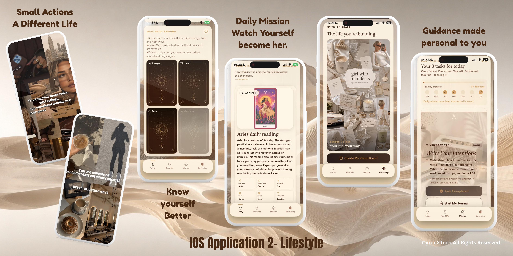

# CyrenX

**Small actions. A different life.**

An iOS lifestyle and self-reflection app bringing daily readings, personal missions, journaling, and vision boards into a warm, cohesive interface.

[Explore the code](Sources/ContentView.swift) · [Run the demo](#run-the-layout-in-xcode) · [Project scope](docs/PROJECT_NOTES.md) · [Developer profile](https://github.com/infoammarai)

## Download and try CyrenX

**[Download on the App Store](https://apps.apple.com/us/app/cyrenx-manifest-become/id6799670474) · [Visit the official website](https://cyrenx.com/)**

**Try it free for 3 days.** Trial availability and eligibility are subject to the offer shown in the app or App Store. Review the subscription price, renewal terms, and cancellation details before starting your trial.

Download the full app through the App Store link above. This GitHub repository contains a simplified layout sample and portfolio materials, not the production app source or an installable IPA.

## App interface showcase

- **Today / Read Me:** daily reading and reflection-card interfaces.
- **Mission:** daily tasks, completion states, and progress tracking.
- **Becoming:** a personal vision board and aspirational imagery.
- **Journaling:** prompts for intentions and personal reflection.

The cream-and-brown palette, serif headings, rounded cards, and gold accents create a calm editorial style. Astrology and card-reading content is presented as lifestyle and entertainment, not verified prediction or professional advice.

[View the full-size showcase](docs/app-showcase.png)

*App presentation supplied by the developer. The montage shows the broader app UI; the public SwiftUI file below is a simplified, independent layout sample and does not reproduce these screens or include their production functionality. The image does not independently verify feature behaviour; see the App Store listing for current availability and product details.*

## Public code sample

| Screen | Layout focus |
| --- | --- |
| Today | Daily check-in, Your routine, A moment to pause |
| Routines | Morning reset, Mindful break, Evening reflection |
| Profile | Your preferences, Personal goals, Weekly reflection |

The sample has working tab navigation and tappable cards that open a preview sheet. All copy is demonstration content. The header uses the developer-supplied app presentation; it is not a screenshot of this sample code.

## For clients and hiring teams

This repository is a small, readable example of SwiftUI interface work: reusable screen composition, local interaction state, SF Symbols, system typography, and adaptive cards. The sample uses no external packages, requires no API keys, and makes no network requests.

**Development approach:** Codex-assisted implementation with Xcode as the intended build and review environment. This is a new public sample; it is not an export of the production source or proof of a released app. Runtime validation is recorded in [project notes](docs/PROJECT_NOTES.md).

For freelance or role enquiries, visit [my GitHub profile](https://github.com/infoammarai). A preferred business contact can be added when available.

## Run the layout in Xcode

1. Clone this repository: `git clone https://github.com/infoammarai/CyrenX-Showcase.git`.
2. In Xcode, create a new **iOS App** using **SwiftUI** and **Swift**. Set the deployment target to iOS 17 or later.
3. Keep Xcode's generated app entry point and replace its `ContentView.swift` with [Sources/ContentView.swift](Sources/ContentView.swift). Do not add a second copy of `ContentView`.
4. Select an installed compatible iPhone Simulator and run. Signing is only needed when running on a physical device.
5. Try all three tabs and tap a card to open and close its preview.

An Xcode project is not bundled; the sample is intentionally a single self-contained SwiftUI file.

## Public scope and privacy

The supplied CyrenX presentation shows a lifestyle and self-reflection interface. The public SwiftUI sample remains a separate basic layout concept; the reading, mission, and vision-board implementations remain private.

Only this layout sample, the supplied app presentation image, and portfolio documentation are public. Production repositories and their Git histories remain private. No backend, account records, private assets, payment flows, credentials, analytics, or production algorithms are included.

The showcase is for lifestyle and self-reflection, not medical advice or a medical service.

## More app showcases

- [WoofyWalky](https://github.com/infoammarai/WoofyWalky-Showcase) — dog care routines
- [ABCTrade](https://github.com/infoammarai/ABCTrade-Showcase) — trading workspace concept
- [CyrenX](https://github.com/infoammarai/CyrenX-Showcase) — wellness concept

## Usage

Published for portfolio review. No open-source licence is granted at this time; contact the owner for reuse permission. Public visibility does not make the private product implementation available.
